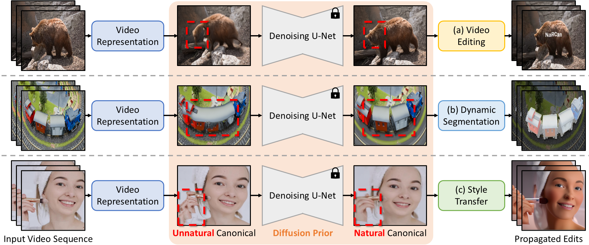
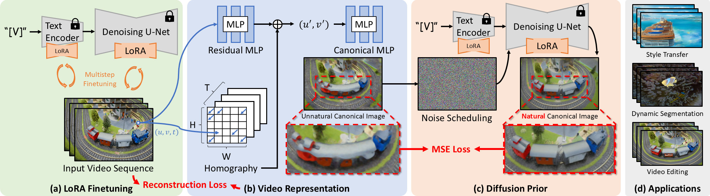

## NaRCan: Natural Refined Canonical Image with Integration of Diffusion Prior for Video Editing
<!-- [](https://arxiv.org/abs/2312.06640)  -->

**NeurIPS 2024**

[](https://koi953215.github.io/NaRCan_page/) 
[](https://arxiv.org/abs/2406.06523) 
[](https://huggingface.co/spaces/Koi953215/NaRCan_demo)  

**NaRCan** a video editing framework, integrates a hybrid deformation field network with diffusion priors to address the challenge of maintaining the canonical image as a natural image.

<p align="center">
    
</p>

---
## Overview
<!--  -->

<p align="center">
    
</p>


## <a name="installation"></a>Installation

```shell
# clone this repo
git clone https://github.com/koi953215/NaRCan.git
cd NaRCan

# create environment
conda create -n narcan python=3.10
conda activate narcan
pip install -r requirements.txt
```

## <a name="Preprocessing"></a>Preprocessing (LoRA Fine-tuning)

Now, we need to use a technique similar to [RealFill](https://realfill.github.io/) to finetune the diffusion model, which is the diffusion prior in our pipeline. **(You can visit this [repo](https://github.com/thuanz123/realfill) for more details about the RealFill environment and operations.)**

<!-- | Model Name | Description | HuggingFace | BaiduNetdisk | OpenXLab |
| :---------: | :----------: | :----------: | :----------: | :----------: |
| v2.pth | IRControlNet trained on filtered laion2b-en  | [download](https://huggingface.co/lxq007/DiffBIR-v2/resolve/main/v2.pth) | [download](https://pan.baidu.com/s/1uTAFl13xgGAzrnznAApyng?pwd=xiu3)<br>(pwd: xiu3) | [download](https://openxlab.org.cn/models/detail/linxinqi/DiffBIR/tree/main) |
| [GMFlow](https://github.com/haofeixu/gmflow) | IRControlNet trained on FFHQ | [download](https://huggingface.co/lxq007/DiffBIR-v2/resolve/main/v1_face.pth) | [download](https://pan.baidu.com/s/1kvM_SB1VbXjbipLxdzlI3Q?pwd=n7dx)<br>(pwd: n7dx) | [download](https://openxlab.org.cn/models/detail/linxinqi/DiffBIR/tree/main) |
-->

First, switch to the RealFill folder.

```
cd realfill
```

And initialize an [🤗Accelerate](https://github.com/huggingface/accelerate/) environment with:

```bash
accelerate config
```

Or for a default accelerate configuration without answering questions about your environment

```bash
accelerate config default
```

Or if your environment doesn't support an interactive shell e.g. a notebook

```python
from accelerate.utils import write_basic_config
write_basic_config()
```

Uniformly sample 5~10 frames from your dataset (scene) and place them in the `ref` folder. Next, put any single frame in the `target` folder and name it `target.png` (in practice, select the middle frame of your scene).

**Note: please organize your dataset using the following folder structure.**

```
data
└─── <your-scene-name>
    ├─── ref
    │    └─── [any number of images]
    └─── target
         ├─── target.png
         └─── mask.png
```

Open `scripts/train.sh` and make the following modifications.

```
export TRAIN_DIR="../data/<your-scene-name>"
export OUTPUT_DIR="../pth_file/<your-scene-name>-model"
```

After completing the above steps, we can begin fine-tuning our model. **(Fine-tuning requires a large amount of GPU memory. If your GPU has limited memory, please refer to the [RealFill GitHub](https://github.com/thuanz123/realfill), which provides detailed instructions on how to train on a low-memory GPU.)**

```
bash scripts/train.sh
```

If you want, you can also run the following command to evaluate whether the fine-tuning was successful. The images generated by this command should be very similar to your `target.png`

```
bash scripts/test.sh
```


## <a name="Train"></a>Train a new model

Now please return to the main `NaRCan` directory and organize your dataset using the following folder structure.

```
data
└─── <your-scene-name>
    └─── <your-scene-name>_all
         └─── [your video frames]
```

The following command will help you complete data preprocessing

```
python create_separation.py -n <your-scene-name>
```

Start training the model

```
python models/homography.py -n <your-scene-name>
```

```
python train.py -n <your-scene-name> -dp <diffusion-path>
```

## <a name="Test"></a>Test reconstruction

If you want to view the reconstruction results, please use the following command

```
python test.py -n <your-scene-name>
```

## Test video translation

**If you are not using Separated NaRCan (meaning you only have one canonical image), please skip the grid trick steps.**

The canonical image will be stored in the `output/<your-scene-name>/separate_n/original_canonical`. At this point, if there are multiple canonical images, we need to use the [grid trick](https://arxiv.org/abs/2312.04524) technique to ensure our edited canonical images maintain sufficient consistency after style transfer.  
  
First, we need to combine multiple canonical images into a single grid

```
python make_grid.py -n <your-scene-name>
```

After obtaining the `merge_canonical.png` through the above steps, use your preferred text prompts to transfer it using [ControlNet](https://github.com/lllyasviel/ControlNet).  
  
Once you have the transferred canonical image, place it in `output/<your-scene-name>/separate_<n>/edited_canonical` (Please note that the file name still needs to be maintained as `merge_canonical.png`).  
    
Finally, please execute the following command

```
python split_grid.py -n <your-scene-name>
```

```
python test_canonical.py -n <your-scene-name>
```

## Citation

Please cite us if our work is useful for your research.

```
@article{chen2024narcan,
  title={NaRCan: Natural Refined Canonical Image with Integration of Diffusion Prior for Video Editing},
  author={Chen, Ting-Hsuan and Chan, Jiewen and Shiu, Hau-Shiang and Yen, Shih-Han and Yeh, Chang-Han and Liu, Yu-Lun},
  journal={Advances in Neural Information Processing Systems},
  year={2024}
}
```

<!-- ## License

This project is released under the [Apache 2.0 license](LICENSE). -->

## Acknowledgement

This research was funded by the [National Science and Technology Council](https://www.nstc.gov.tw/?l=en), Taiwan, under Grants NSTC 112-2222-E-A49-004-MY2. The authors are grateful to [Google](https://about.google/), [NVIDIA](https://www.nvidia.com/en-us/), and [MediaTek Inc](https://www.mediatek.com/). for generous donations. Yu-Lun Liu acknowledges the Yushan Young Fellow Program by the MOE in Taiwan.

<!-- ## Contact

If you have any questions, please feel free to contact with me at tchen783@usc.edu -->